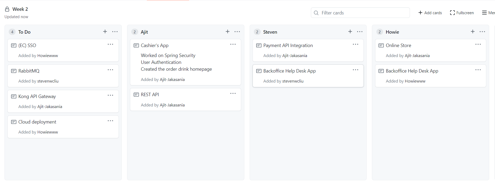
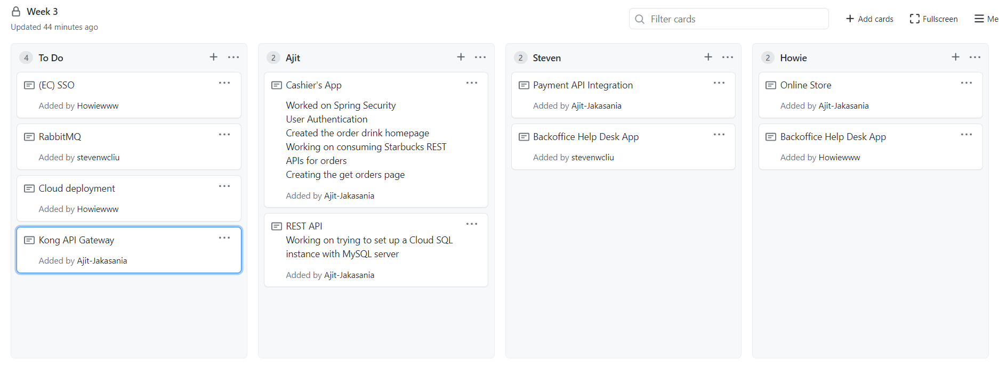
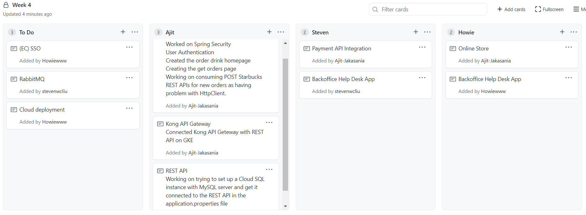

# CMPE 172 - Skyline Cloud 
## Starbucks Online Order

### Week 1

 Figure 1. Project Task Board for Week 1.

For week 1, I am working on Starbucks-api and Cashier's App both on which are java spring boot project. We as a group decided to start our starbucks-api project from lab 6 code.
I worked on modifiying API's according to our need and also started working on the cashier's app which will have a MVC design pattern. 

Source Code in sp21-172-skyline-cloud/starbucks-api/ folder, link: https://github.com/nguyensjsu/sp21-172-skyline-cloud/tree/main/starbucks-api 

Spring Dependencies for Cashier's App: 
  * Spring Web
  * Thymleaf
  * Spring Boot DevTools
  * Lambok
  * MySQL Driver
  * Spring Data JPA

I encoutered problem when trying to reteive data from database as I was not familiar with CRUPRespository methods so had to view the documentation for the return object type 
when using methods and also for query lookup strategies viewed spring data jpa documentation.

---
### Week 2

#### Task Board

I'm currently working on the cashier's application.

#### Accomplishment

For week 2, I finished the implementation of the starbucks order page of the cashier's app. I have also used Spring Security dependency for User Autehntication. I will keep be now working on other pages and also consuming the REST API requests for ordering drinks.

The source code is located at: https://github.com/nguyensjsu/sp21-172-skyline-cloud/tree/main/spring-cashier

### Week 3

#### Task Board

I'm currently working on the cashier's application.

#### Accomplishment

For week 3, I finished the implementation of the starbucks order page of the cashier's app and working on the get orders page. I am also modifying the designController for the orders and consuming the Starbucks REST APIs using the API Keys for API Authentication.

The source code is located at: https://github.com/nguyensjsu/sp21-172-skyline-cloud/tree/main/spring-cashier

### Week 4

#### Task Board

I'm currently working on the cashier's application.

#### Accomplishment

For week 4, I finished the implementation of the starbucks order page of the cashier's app and working on the get orders controller. I am also modifying the designController for the orders and consuming the Starbucks REST API using the API Keys for API Authentication for new order and get orders. Setup the Kong API getway connecting to REST API on GKE. Working on connecting the Cloud SQL to REST API and saving data in MySQL database rather than H2 in-memory database.

The source code is located at: https://github.com/nguyensjsu/sp21-172-skyline-cloud/tree/main/spring-cashier

