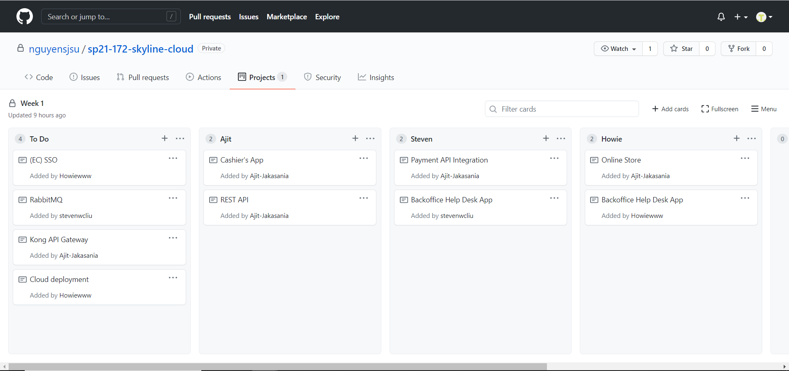

# CMPE 172 - Skyline Cloud 
## Starbucks Online Order

### Week 1

 Figure 1. Project Task Board for Week 1.

For week 1, I am working on Starbucks-api and Cashier's App both on which are java spring boot project. We as a group decided to start our starbucks-api project from lab 6 code.
I worked on modifiying API's according to our need and also started working on the cashier's app which will have a MVC design pattern. 

Source Code in sp21-172-skyline-cloud/starbucks-api/ folder, link: https://github.com/nguyensjsu/sp21-172-skyline-cloud/tree/main/starbucks-api 

Spring Dependencies for Cashier's App: 
  * Spring Web
  * Thymleaf
  * Spring Boot DevTools
  * Lambok
  * MySQL Driver
  * Spring Data JPA

I encoutered problem when trying to reteive data from database as I was not familiar with CRUPRespository methods so had to view the documentation for the return object type 
when using methods and also for query lookup strategies viewed spring data jpa documentation.
