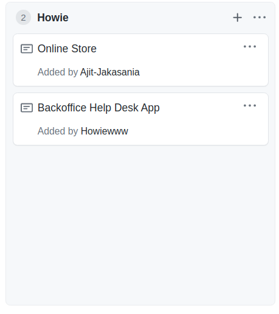

#Week 1

##1 Task Board

I'm currently working on the online store application.

##2 Accomplishment

I have using lab 6 as an example to start with the starbucks online store where the API needed are pretty similar. Later on I will modify the HTML to make the interface matched with the working API. 

The source code is located at: https://github.com/nguyensjsu/sp21-172-skyline-cloud/tree/main/online-store/